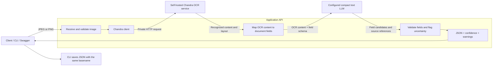

# Environmental Document Extraction

An API that turns photographed environmental inspection documents into structured JSON.

The project uses **Chandra as a self-hosted OCR service** to read document images. A separate extraction layer maps the recognized content to fields such as document number, dates, people, property registration, areas, and fines.

Every result is a draft for human review. Missing or uncertain information is reported explicitly.

> Status: containerized FastAPI service scaffold. Image validation and the Chandra
> HTTP client are implemented; OCR and compact text field mapping are intentionally
> pending.

## Running with Docker

The recommended deployment keeps the API and OCR in separate containers on a
private Compose network. The temporary OCR container is live but always returns
`503 model_not_ready`; it never produces simulated OCR content.

```bash
docker compose build --pull
docker compose up --detach
```

Open <http://127.0.0.1:8000/docs> for the API documentation. The API liveness probe
is available at <http://127.0.0.1:8000/live>. Application health remains
`degraded` until a real OCR image replaces the placeholder.

See [`docs/docker.md`](docs/docker.md) for image targets, security decisions,
operations, standalone builds, and instructions for replacing the OCR service.

## Running the API locally

Python 3.11 or newer is recommended. Create an isolated environment, install the
development dependencies, copy the example configuration, and start Uvicorn:

```bash
python -m venv .venv

# Linux/macOS
source .venv/bin/activate
cp .env.example .env

# Windows PowerShell
.venv\Scripts\Activate.ps1
Copy-Item .env.example .env

python -m pip install -r requirements-dev.txt
uvicorn app.main:app --reload
```

The API documentation is then available at <http://127.0.0.1:8000/docs>.
Run the contract tests with:

```bash
pytest
```

Configuration is read from `.env` or from environment variables prefixed with
`APP_`. The most important setting is `APP_CHANDRA_BASE_URL`, which must point to
the private project wrapper described below. File size, decoded pixel count,
concurrency, dependency timeout, and total processing deadline are configurable;
see [`.env.example`](.env.example) for all initial values.

### Current project structure

```text
app/
├── api/routes.py              # /live, /health, and /extract
├── core/config.py             # validated APP_* settings
├── core/errors.py             # consistent public error responses
├── schemas/                   # OCR, extraction, health, and error contracts
├── services/image_processor.py # byte/format/dimension validation and EXIF rotation
├── services/ocr_client.py     # Chandra wrapper HTTP client
├── services/field_mapper.py   # mapper boundary and safe pending implementation
├── services/extraction.py     # deadline and concurrency orchestration
└── main.py                    # FastAPI application factory
ocr_placeholder/main.py       # explicit 503 service until Chandra is implemented
docs/
├── chandra-wrapper.md         # human-readable wrapper contract
├── chandra-wrapper.openapi.yaml # machine-readable OpenAPI 3.1 contract
└── docker.md                  # container build and operation guide
Dockerfile                     # hardened multi-stage API and placeholder targets
compose.yaml                   # private API-to-OCR service network
requirements.txt               # production dependencies
requirements-dev.txt           # production dependencies plus test tooling
tests/                         # API, dependency-failure, and placeholder tests
```

Until a compact text model and its deployment contract are selected, successful
OCR calls return the complete output schema with field values set to `null`, field
status `not_processed`, confidence `0`, and a
`field_mapping_not_configured` warning. This is deliberate: the service never
presents an unimplemented mapping stage as a confident extraction. OCR failures
still return the documented dependency error instead of an empty success.

The initial scaffold was validated with Python 3.12.3 and the exact package
versions recorded in `requirements.txt` and `requirements-dev.txt`. Chandra itself
is a separate deployment and is not installed by the API image.

### Expected Chandra wrapper contract

The complete wrapper contract is documented in
[`docs/chandra-wrapper.md`](docs/chandra-wrapper.md). A machine-readable OpenAPI
3.1 specification is provided in
[`docs/chandra-wrapper.openapi.yaml`](docs/chandra-wrapper.openapi.yaml).

The API sends `multipart/form-data` with one `image` part to `POST /ocr`. The
initial wrapper response contract is:

```json
{
  "content": "recognized text or document representation",
  "regions": [
    {"id": "region-1", "text": "source text"}
  ],
  "model_version": "datalab-to/chandra-ocr-2@pinned-revision",
  "duration_ms": 1234,
  "warnings": []
}
```

Additional keys may be placed inside each region while the top-level response is
kept strict. An invalid response produces `502`; an unavailable service produces
`503`; and timeouts produce `504`.

## Initial scope

- Accept one JPEG or PNG image per request.
- Read Portuguese printed and handwritten documents.
- Use our own Chandra deployment for OCR.
- Map OCR content to a consistent document schema.
- Return JSON with field confidence, source excerpts, and warnings.
- Export one JSON file per image, using the same basename.

The initial application waits for processing to finish before responding. It does not require a database, job queue, or background worker.

Batch processing, document grouping, automatic reconciliation, and a review interface are future improvements.

## Architecture

The application API and the Chandra OCR service run separately. Field extraction and validation remain modules inside the application.



Chandra reads the page. The compact text LLM assigns meaning to its content. Application code enforces the output contract and applies validation rules.

The text model receives OCR content, not the original image. Its output must remain supported by that content; it cannot reliably recover characters that OCR missed.

The initial request uses one OCR pass and at most one text-model call. There is no automatic fallback to a larger model.

## Document processing

```mermaid
flowchart TB
    Client["Upload one document image"]

    subgraph Input["1. Image preparation"]
        Receive["POST /extract"]
        Available{"Processing slot available?"}
        Busy["429 - Application busy"]
        Check["Check file bytes, JPEG/PNG format,<br/>file size and decoded dimensions"]
        ValidImage{"Valid image?"}
        InputError["413 / 415 / 422 - Input error"]
        Orient["Apply EXIF orientation<br/>Preserve color and readable resolution"]
    end

    subgraph OCR["2. Self-hosted OCR"]
        OCRRequest["Send image to the Chandra service"]
        Read["Recognize printed and handwritten content<br/>Retain tables, marks, headers and footers"]
        OCRResult["Return recognized content<br/>and available layout metadata"]
    end

    subgraph Extraction["3. Field extraction"]
        Prepare["Prepare OCR content and output schema<br/>Exclude filename and occurrence summary"]
        Map["Compact text LLM maps document identity,<br/>dates, parties, property and referenced documents"]
        Details["Map areas, coordinates, legal citations,<br/>fine, officer registration and signature descriptions"]
        Gaps["Return null for unsupported or ambiguous values<br/>Attach field status and source excerpts"]
    end

    subgraph Validation["4. Validation"]
        Schema{"Valid JSON structure and field types?"}
        InvalidOutput["502 - Invalid dependency output"]
        Rules["Check dates, numeric values and identifiers<br/>Preserve zeros and coordinate strings"]
        Evidence["Check source references against OCR content<br/>Flag conflicting or unsupported candidates"]
        Scores["Assign conservative heuristic confidence<br/>Require human review"]
    end

    subgraph Output["5. Response and export"]
        Build["Build official fields + confidence<br/>Add _meta, _review and _warnings"]
        Return["200 application/json<br/>Partial results include nulls and warnings"]
        Save["CLI saves image-basename.json"]
        Review["Inspector checks the result against the image"]
    end

    DependencyError["503 / 504 - Service unavailable or timeout"]

    Client --> Receive
    Receive --> Available
    Available -->|"No"| Busy
    Available -->|"Yes"| Check
    Check --> ValidImage
    ValidImage -->|"No"| InputError
    ValidImage -->|"Yes"| Orient
    Orient --> OCRRequest
    OCRRequest --> Read
    Read --> OCRResult
    OCRResult --> Prepare
    OCRRequest -->|"Failure or timeout"| DependencyError
    Prepare --> Map
    Map --> Details
    Map -->|"Failure or timeout"| DependencyError
    Details --> Gaps
    Gaps --> Schema
    Schema -->|"No"| InvalidOutput
    Schema -->|"Yes"| Rules
    Rules --> Evidence
    Evidence --> Scores
    Scores --> Build
    Build --> Return
    Return --> Save
    Save --> Review
```



The tasks inside field extraction belong to one model request. They are not separate calls for every field.

Recognizing handwriting, checkboxes, or a signature mark does not guarantee correct interpretation. The original image remains the reference for human review.

## Chandra service

[Chandra](https://github.com/datalab-to/chandra) supports document OCR with layout information and local Hugging Face or vLLM inference. The selected starting checkpoint is [datalab-to/chandra-ocr-2](https://huggingface.co/datalab-to/chandra-ocr-2); pin its revision and runtime versions after testing.

Deploy a small private HTTP wrapper around the Chandra inference pipeline:

| Internal endpoint | Purpose |
|---|---|
| `GET /health` | Report whether the OCR service is ready |
| `POST /ocr` | Accept one image and return OCR content and available layout |

These are **project-defined wrapper endpoints**, not endpoints provided by Chandra itself. The wrapper may load the model directly or call a self-hosted vLLM instance.

Its response should expose recognized content, available region references, model version, processing duration, and warnings. Preserve source content before mapping it to business fields.

Enable header and footer inclusion: document identifiers and agency information can appear there. The upstream CLI excludes them by default. Follow the [official Chandra configuration](https://github.com/datalab-to/chandra#usage) for the pinned version.

Chandra's document output is an intermediate representation. It is not the final environmental inspection JSON.

## Output contract

All common fields appear at the top level. Unknown values are `null`.

| Group | Fields |
|---|---|
| Document identity | `document_type`, `number`, `series`, `year` |
| Issuance | `issued_date`, `issued_time`, `municipality`, `agency` |
| People | `parties` |
| Property | `property_name`, `car` |
| Location and area | `coordinates`, `area_ha` |
| Legal information | `legal_basis`, `fine_brl` |
| Related documents | `references` |
| Officer and signatures | `officer_registration`, `signatures` |
| Confidence | `confidence` |

Supported document types:

```text
finding_notice, infraction_notice, embargo_notice, seizure_notice,
notification, inspection_order, complaint_record, inspection_report,
case_file_cover, deforestation_validation
```

Each party contains `role`, `name`, `document_id`, and `address`. Supported roles are `cited_party`, `issuer`, `witness`, `found_on_site`, and `representative`.

Each reference contains `document_type`, `number`, and `year`. Signatures use `issuer` and `cited_party`, with descriptions that distinguish present, absent, refused, and unreadable.

Key rules:

- Keep document numbers as strings, including leading zeros.
- Separate `number` from `year`.
- Use `DD/MM/YYYY` for issuance dates and `HH:MM` for times.
- Preserve coordinates and personal/property identifiers as printed.
- Validate coordinates geometrically (lat ≤ 90°, min/sec < 60); flag even when confidence is high.
- Return `area_ha` and `fine_brl` as JSON numbers.
- Do not confuse the inspection date with the issuance date.
- Do not merge a referenced document number into the current document identity.
- Do not add overlapping areas or calculate an unstated fine as if it were printed.
- Use `[]` for a collection confirmed empty; use `null` if it cannot be assessed.
- Extract only the supplied page; do not fill gaps from another document.

The optional `fields` object may store verbatim form entries later.

### Review information

The application adds:

- `_meta`: model versions, duration, available usage, and `review_required: true`.
- `_review`: field status, source excerpt or region reference, and explanation.
- `_warnings`: validation problems and unresolved uncertainty.

`confidence` contains a score between 0 and 1 for each common field. Initial scores are **heuristic review priorities**, not calibrated probabilities. Mark this with `_meta.confidence_kind = "heuristic"`.

Distinguish `extracted`, `not_present`, `explicitly_absent`, `unreadable`, `ambiguous`, and `not_processed`. Failure to find a value in OCR alone does not prove that the original image lacks it.

Do not assume Chandra provides calibrated field confidence. Check source excerpts against OCR content and keep uncertain candidates low-confidence or null. Matching OCR text still does not prove that the image was read correctly.

## API

| Endpoint | Behavior |
|---|---|
| `GET /live` | Report application-process liveness without calling dependencies |
| `GET /health` | Report application health |
| `POST /extract` | Accept an image and return the extraction JSON |
| `GET /docs` | Open the interactive API documentation |

Target request:

```bash
curl -X POST "http://127.0.0.1:8000/extract" \
  -F "image=@./document.jpg"
```

A successful response is `200 application/json`. Partially readable documents can return successful results with null fields and warnings.

| Status | Meaning |
|---|---|
| `413` | File or decoded image exceeds limits |
| `415` | Unsupported image format |
| `422` | Invalid or corrupted image |
| `429` | Processing capacity reached |
| `502` | OCR or field-mapping response is invalid |
| `503` | Required service is unavailable |
| `504` | Processing deadline exceeded |

Use a configurable total deadline across OCR and field mapping. Disable automatic retries initially and return clear errors. A failed dependency call must not appear as a successful empty extraction.

## Acceptance criteria

- [ ] A user can upload one JPEG or PNG and receive valid JSON.
- [ ] OCR runs through the project's self-hosted Chandra service.
- [ ] Field mapping uses OCR content and preserves source references.
- [ ] Every common output field exists with the expected type or an explicit gap.
- [ ] Leading zeros, document references, and coordinate strings are preserved.
- [ ] Ambiguous or unreadable values are null with low confidence and an explanation.
- [ ] Every result requires human review.
- [ ] Invalid files, dependency errors, busy responses, and timeouts are handled explicitly.
- [ ] CLI export produces one JSON per image with the same basename.
- [ ] Evaluation reports field errors, missing values, latency, and measured resource usage.
- [ ] Setup documentation identifies tested versions, model configuration, and hardware.
- [ ] Tests cover the API contract, key transcription rules, and dependency failures.

## Points of attention

- **OCR is not ground truth.** A mapper can repeat or amplify reading errors. Always allow comparison with the original image.
- **Portuguese handwriting needs evaluation.** General model capabilities do not establish accuracy on these forms.
- **Preserve document context.** Headers, footers, tables, marks, dates, and document references may carry essential information.
- **Confidence is provisional.** Valid JSON and plausible identifiers do not prove that extracted facts are correct.
- **Self-hosting has operating costs.** Measure model startup, memory, processing time, and concurrency on the target machine.
- **Data stays private only if every stage does.** A remote text mapper receives document content even when OCR is local. Configure an approved deployment and keep images, OCR output, credentials, and sensitive logs out of public repositories.
- **Check model licensing.** Chandra code and weights have different licenses; verify the terms for the intended use and checkpoint. [Upstream licensing](https://github.com/datalab-to/chandra#commercial-usage)
- **Requests are not durable.** Restarts lose active work, and resubmission can repeat processing. Deadline expiry does not guarantee that downstream inference has stopped.
- **Document content is untrusted input.** The mapper must treat instructions printed on a page as data and have no tools for executing them.
- **Signature extraction is descriptive.** The system does not authenticate signatures or approve legal conclusions.
