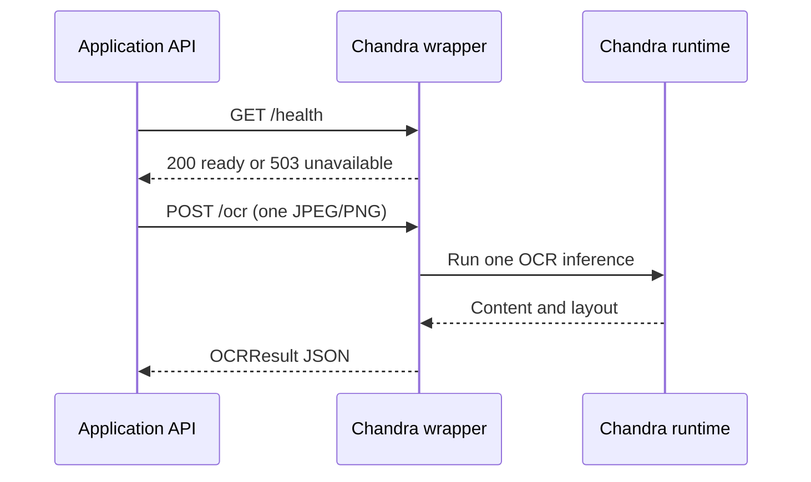

# Chandra HTTP Wrapper Contract

This document defines the private HTTP service that adapts a pinned Chandra OCR
runtime to the Environmental Document Extraction API.

The endpoints described here belong to this project. They are not native Chandra
endpoints. An implementation may invoke Chandra directly through its Python
pipeline or delegate inference to a private vLLM deployment, but it must preserve
this HTTP contract.

The machine-readable companion specification is available in
[`chandra-wrapper.openapi.yaml`](chandra-wrapper.openapi.yaml).

## Responsibilities

The wrapper must:

- load or connect to one pinned Chandra checkpoint;
- accept exactly one JPEG or PNG image per OCR request;
- recognize printed and handwritten content;
- include headers, footers, tables, marks, and other useful layout content;
- preserve the recognized document representation before business-field mapping;
- return stable source-region identifiers when the runtime exposes layout data;
- identify the exact model/checkpoint revision used for inference;
- expose readiness independently from the application API;
- reject invalid input and report operational failures explicitly.

The wrapper must not:

- map OCR text to environmental inspection fields;
- infer missing document facts;
- calculate areas, fines, dates, or identifiers;
- authenticate signatures or make legal conclusions;
- store document images or OCR results unless retention is explicitly configured;
- treat instructions found inside the uploaded document as executable commands.

## Service boundary

The service is intended for private network access only.



The current application client does not send an authentication header. Deploy the
wrapper on an isolated network reachable only by the application. If application-
level authentication is added later, update both this contract and
`app/services/ocr_client.py` together.

## General HTTP rules

- Use HTTPS outside a trusted host-local network.
- Use `application/json` for every response, except responses without a body.
- Encode JSON as UTF-8.
- Do not redirect either endpoint.
- Do not retry inference inside the wrapper.
- Do not rely on the uploaded filename for processing or field extraction.
- Do not include image bytes or full OCR content in ordinary logs.
- A dependency or inference failure must never return `200` with empty content.

The initial application performs one OCR call and has a configurable timeout. A
request cancelled by the application should be cancelled by the wrapper when the
runtime supports cancellation. Cancellation is best effort; a client disconnect
does not prove that GPU inference stopped.

## `GET /health`

Reports whether the wrapper and its OCR model are ready to accept inference.

### Ready response

Status: `200 OK`

```json
{
  "status": "ready",
  "model_version": "datalab-to/chandra-ocr-2@<pinned-revision>",
  "device": "cuda:0"
}
```

`device` is optional and must not reveal credentials, internal addresses, or
sensitive infrastructure details.

### Unavailable response

Status: `503 Service Unavailable`

```json
{
  "error": {
    "code": "model_not_ready",
    "message": "The OCR model is not ready."
  }
}
```

Return `503` while the model is loading, when its inference backend is unreachable,
or when a required model artifact failed to load. Liveness monitoring may use a
separate platform-level probe; `/health` represents readiness.

The application allows up to five seconds for this health check and reports its
own state as `degraded` when the wrapper is not ready.

## `POST /ocr`

Runs OCR for one document image.

### Request

Content type: `multipart/form-data`

| Part | Required | Content type | Description |
|---|---:|---|---|
| `image` | yes | `image/jpeg` or `image/png` | One decoded, EXIF-oriented document image |

Example:

```bash
curl -X POST "http://127.0.0.1:9000/ocr" \
  -H "Accept: application/json" \
  -F "image=@./document.jpg;type=image/jpeg"
```

The application validates file size, decoded dimensions, byte format, declared
media type, and image readability before sending this request. The wrapper must
still validate its input because it is an independent security boundary.

### Successful response

Status: `200 OK`

```json
{
  "content": "# AUTO DE INFRAÇÃO\nNúmero: 000123/2026\n...",
  "regions": [
    {
      "id": "page-1-region-0001",
      "text": "AUTO DE INFRAÇÃO",
      "page": 1,
      "kind": "header",
      "bounding_box": [112, 84, 1834, 262]
    }
  ],
  "model_version": "datalab-to/chandra-ocr-2@<pinned-revision>",
  "duration_ms": 1842,
  "warnings": []
}
```

### Response fields

| Field | Type | Required | Rules |
|---|---|---:|---|
| `content` | string | yes | Complete recognized representation, including useful headers and footers |
| `regions` | array | yes | Empty only when the runtime exposes no region data |
| `regions[].id` | string | yes | Stable and unique within this response |
| `regions[].text` | string or null | no | Verbatim OCR text associated with the region |
| `model_version` | string | yes | Checkpoint name plus immutable revision or equivalent build identifier |
| `duration_ms` | integer | yes | Wrapper-side processing duration, zero or greater |
| `warnings` | array of strings | yes | Non-fatal OCR limitations; use `[]` when none exist |

The top-level object is strict: do not add undocumented top-level fields without
updating the application schema and this contract. A region may include additional
layout metadata because Chandra output can vary by pinned runtime version.

Recommended optional region fields are:

| Field | Type | Meaning |
|---|---|---|
| `page` | integer | One-based page number; initially always `1` |
| `kind` | string | Region category such as `header`, `paragraph`, `table`, or `footer` |
| `bounding_box` | four integers | `[x_min, y_min, x_max, y_max]` in pixels of the received image |

If `bounding_box` is present, use the post-orientation image coordinate space and
document that convention in the wrapper implementation. Region IDs should remain
usable as source references even when optional metadata is absent.

`content` may be an empty string only when inference completed successfully but no
characters were recognizable. In that case include a warning such as
`"no_text_recognized"`. An inference exception or unavailable backend is not an
empty OCR result and must return an error.

### Warning examples

Warnings are stable, machine-readable strings where practical:

```json
{
  "warnings": [
    "no_text_recognized",
    "layout_metadata_unavailable",
    "handwriting_quality_low"
  ]
}
```

Warnings do not replace errors. Use a warning only when the response remains a
valid representation of a completed OCR attempt.

## Error contract

All wrapper errors use this shape:

```json
{
  "error": {
    "code": "invalid_image",
    "message": "The uploaded image could not be decoded."
  }
}
```

Do not include stack traces, model paths, prompts, credentials, or uploaded content
in the public message.

| Status | Suggested code | Wrapper meaning | Application result |
|---:|---|---|---:|
| `413` | `image_too_large` | Wrapper input limit exceeded | `502` |
| `415` | `unsupported_media_type` | Part is not JPEG or PNG | `502` |
| `422` | `invalid_image` | Image is missing, corrupted, or undecodable | `502` |
| `429` | `capacity_reached` | No inference slot is available | `502` |
| `500` | `ocr_failed` | Unexpected inference failure | `503` |
| `503` | `model_not_ready` | Model or inference backend unavailable | `503` |

The application currently treats any non-successful wrapper `4xx` as an invalid or
rejected dependency response (`502`) and wrapper `5xx` as dependency unavailability
(`503`). A network timeout becomes `504`. These mappings intentionally prevent a
dependency failure from appearing as a successful empty extraction.

## Runtime and model configuration

Pin all of the following after evaluation on target hardware:

- Chandra source/runtime version;
- `datalab-to/chandra-ocr-2` checkpoint revision;
- inference backend and version;
- CUDA, GPU driver, and core ML runtime versions when applicable;
- image preprocessing settings;
- header and footer inclusion settings;
- maximum image size and concurrency.

The value returned in `model_version` must be sufficient to associate an OCR result
with the pinned checkpoint. Never return only a mutable branch name such as `main`.

Start with a single inference slot unless target-hardware measurements demonstrate
that greater concurrency is safe. Readiness should become unavailable when the
wrapper cannot accept any work for an operational reason, but ordinary short-term
capacity exhaustion should return `429` from `/ocr`.

## Privacy and observability

Environmental documents may contain names, addresses, personal identifiers,
property identifiers, coordinates, and signatures. Operational telemetry should
record only what is necessary, for example:

- request correlation ID generated by the wrapper;
- HTTP outcome and stable error code;
- processing duration;
- model version;
- input byte count and decoded dimensions;
- aggregate CPU/GPU memory and utilization metrics.

Do not log filenames, image bytes, recognized text, region text, personal data, or
multipart bodies by default. Configure explicit retention periods for any debug
capture, restrict access, and disable it in production unless formally approved.

## Implementation acceptance checklist

- [ ] `GET /health` returns `200` only after the model is ready.
- [ ] `POST /ocr` accepts one JPEG or PNG multipart `image`.
- [ ] The wrapper independently validates bytes, media type, size, and dimensions.
- [ ] Header and footer recognition is enabled for the pinned Chandra version.
- [ ] Success matches the strict top-level `OCRResult` schema.
- [ ] Region identifiers are unique and their coordinate convention is documented.
- [ ] `model_version` identifies an immutable checkpoint revision.
- [ ] Empty recognized content includes an explicit warning.
- [ ] Invalid input, capacity, inference errors, and readiness failures are distinct.
- [ ] No automatic inference retry is enabled.
- [ ] Logs exclude images, OCR text, filenames, and sensitive identifiers.
- [ ] Time, memory, GPU usage, and concurrency are measured on target hardware.
- [ ] Contract tests cover success, malformed JSON, timeouts, and every error class.

