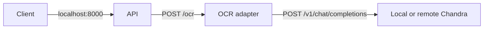

# Docker deployment

This guide is for developers and operators running the API with a local or remote Chandra backend. Success means both Compose services are healthy and `POST /ocr` returns Chandra content.

## Run with the local llama.cpp backend

Requirements:

- Docker Engine with the Compose plugin;
- Chandra available through an OpenAI-compatible API;
- the Chandra container connected to external Docker network `llm` with alias `llamactl`;
- model name `chandra-ocr`, or a matching `OCR_BACKEND_MODEL` value.

The current local default is `http://llamactl:9099/v1`. The OCR adapter joins the same external `llm` network as the Chandra container.

Create one complete local configuration:

```bash
cp .env.example .env.local
```

Build and start both services:

```bash
docker compose --env-file .env.local build --pull
docker compose --env-file .env.local up --detach
docker compose --env-file .env.local ps
```

Expected services:

- `api` serves port `8000` on the host;
- `ocr` serves port `9000` only inside the Compose network.

Check the public API:

```bash
curl http://127.0.0.1:8000/live
curl http://127.0.0.1:8000/health
```

`/live` reports `alive`. `/health` reports `ok` when the adapter can find the configured model.

Stop the deployment:

```bash
docker compose --env-file .env.local down
```

## Use a remote Chandra backend

Change these values in `.env.local`:

```dotenv
OCR_BACKEND_BASE_URL=https://<OCR_HOST>/v1
OCR_BACKEND_MODEL=chandra-ocr
OCR_BACKEND_API_KEY=<SECRET>
OCR_MODEL_VERSION=<PINNED_MODEL_VERSION>
```

The adapter sends `OCR_BACKEND_API_KEY` as a bearer token. Keep `.env.local` untracked. Use HTTPS outside a trusted local network.

Restart Compose and check `/health` after changing the backend.

## Service flow



The adapter validates the image again because it is a separate security boundary. It converts Chandra's normalized layout boxes to pixel coordinates and returns the stable project `OCRResult`.

The API performs [OpenCV image cleaning](image-cleaning.md) before its `/ocr`
request. `opencv-python-headless` and NumPy are installed from `requirements.txt`
in the shared dependency stage; no display server is needed. Rebuild after updating
dependencies. Set `APP_IMAGE_CLEANING_ENABLED=false` in `.env.local` and recreate
the API to compare with EXIF-only preparation.

## Image targets

| Target | Process | Host exposure |
|---|---|---|
| `api` | `app.main:app` on port `8000` | published by Compose |
| `ocr-adapter` | `ocr_adapter.main:app` on port `9000` | private Compose network |

Build either target directly:

```bash
docker build --target api -t environmental-document-extraction-api:local .
docker build --target ocr-adapter -t environmental-document-extraction-ocr-adapter:local .
```

## Runtime properties

Both Python images:

- run as unprivileged user `10001`;
- use a read-only root filesystem in Compose;
- drop all Linux capabilities;
- disable privilege escalation;
- store temporary multipart data in a size-limited `/tmp` filesystem;
- exclude image bytes, OCR text, model paths, and credentials from application logs.

The OCR adapter does not load model weights. GPU lifecycle and memory belong to the configured Chandra backend.

## Configuration reference

| Variable | Default | Purpose |
|---|---|---|
| `OCR_BACKEND_BASE_URL` | `http://llamactl:9099/v1` in Compose | OpenAI-compatible API base URL |
| `OCR_BACKEND_MODEL` | `chandra-ocr` | Model sent in inference requests |
| `OCR_BACKEND_API_KEY` | empty | Optional remote bearer token |
| `OCR_MODEL_VERSION` | `chandra-ocr-2.Q8_0+mmproj-f16` | Version returned in OCR metadata |
| `OCR_BACKEND_TIMEOUT_SECONDS` | `90` | Backend request timeout |
| `OCR_MAX_OUTPUT_TOKENS` | `12384` | Chandra output limit |
| `OCR_MAX_CONCURRENT_REQUESTS` | `1` | Adapter inference slots |
| `OCR_MAX_FILE_SIZE_BYTES` | `15728640` | Upload byte limit |
| `OCR_MAX_IMAGE_PIXELS` | `40000000` | Decoded pixel limit |

Pin the llama.cpp image digest and model artifact hashes before production use. The default model version describes the current local files but is not an immutable content hash.
