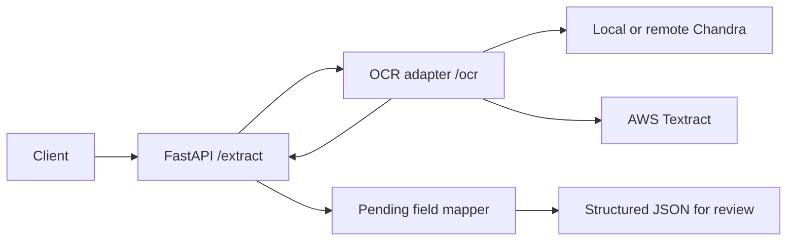

# Explanation: architecture and processing

## Interchangeable OCR backends

The API calls one private OCR adapter. The adapter selects a backend from `OCR_PROVIDER` and returns one stable response shape.

Chandra returns layout HTML. Textract returns line blocks with normalized geometry. The adapter converts both into the same content and pixel-region contract, so the API does not know which provider ran.

## Processing flow

1. Validate one JPEG or PNG upload.
2. Send image bytes to the selected OCR backend.
3. Convert backend output into text and regions.
4. Pass OCR content to field mapping.
5. Return fields, confidence, review data, and warnings.

The service is review-oriented. OCR output is not ground truth. Missing or ambiguous values remain null and require checking against the original image.

## Runtime boundaries

The API and OCR adapter run as separate services. Chandra/llamactl runs outside this project on the external `llm` network. Textract is a remote AWS dependency. The adapter hides these deployment differences behind one HTTP contract.

The initial request is synchronous. There is no database, queue, batch grouping, automatic reconciliation, or review UI.
