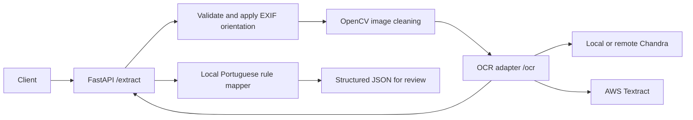

# Explanation: architecture and processing

## Interchangeable OCR backends

The API calls one private OCR adapter. The adapter selects a backend from `OCR_PROVIDER` and returns one stable response shape.

Chandra returns layout HTML. Textract returns line blocks with normalized geometry. The adapter converts both into the same content and pixel-region contract, so the API does not know which provider ran.

## Processing flow

1. Validate one JPEG or PNG upload, including byte and pixel limits.
2. Apply EXIF orientation and, by default, clean the image with OpenCV: composite
   transparency on white, convert to grayscale, reduce noise, and normalize the
   estimated paper illumination. Encode a lossless PNG and check its byte limit.
3. Send the prepared image to the selected OCR backend through the adapter.
4. Convert backend output into text and regions.
5. Map explicit titles and labels using OCR text and source regions.
6. Resolve conflicts, validate field formats, and return fields, heuristic
   confidence, review evidence, and warnings. See [field mapping](field-mapping.md).

Cleaning preserves dimensions after EXIF orientation, so OCR region coordinates
stay aligned with the oriented document. CPU processing runs in a worker thread;
the extraction concurrency limit includes that work. Direct calls to the private
`/ocr` endpoint bypass cleaning. See [design and validation](image-cleaning.md).

The service is review-oriented. OCR output is not ground truth. Missing or ambiguous values remain null and require checking against the original image.

## Runtime boundaries

The API and OCR adapter run as separate services. Chandra/llamactl runs outside this project on the external `llm` network. Textract is a remote AWS dependency. The adapter hides these deployment differences behind one HTTP contract.

The initial request is synchronous. There is no database, queue, batch grouping, automatic reconciliation, or review UI.
